# 物联网安全期末复习

author ： 李昌

## 1、课后习题 

#### **什么是物联网，它的体系结构是什么？**

* 广义定义：从广义上说，指的是利用局部网络或互联网等通信技术把传感器、控制器、机器、人员和物等通过新的方式联在一起，形成人与物、物与物相联，实现信息化、远程管理控制和智能化的网络。  
* 狭义定义：通过各种传感技术，如RFID、传感器、GPS、摄像机、激光扫描器，将任何物体与互联网相连接，以实现远程监视、自动报警、控制、诊断和维护，进而实现“管理、控制、营运”一体化的一种网络。  

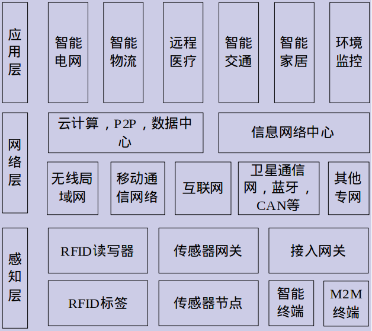

#### **简述RFID的工作原理，RFID的安全技术**

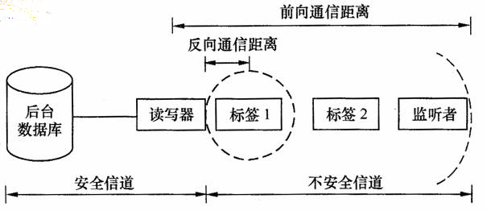 
RFID系统的基本工作原理是：

* 阅读器与标签之间通过无线信号建立双方通信的通道，阅读器通过天线发出电磁信号，电磁信号携带了阅读器向标签的查询指令。

* 当标签处于阅读器工作范围时，标签将从电磁信号中获得指令数据和能量，并根据指令将标签标识和数据以电磁信号的形式发送给阅读器，或根据阅读器的指令改写存储在RFID标签中的数据。  

* 阅读器可接收RFID标签发送的数据或向标签发送数据，并能通过标准接口与后台服务器通信网络进行对接，实现数据的通信传输。

* 根据标签能量获取方式，RFID系统工作方式可分为：近距离的电感耦合方式和远距离的电磁耦合方式。

RFID的安全技术：  
1. 物理安全机制
    * Kill命令机制
    * 法拉第网罩
    * 主动干扰
    * 阻塞标签
    * 可分离标签
2. 逻辑安全机制
    * 哈希锁方案
    * 随机Hash锁方案
    * Hash链方案
    * 匿名ID方案
    * 重加密方案

#### **简述物联网的安全体系结构以及各层的主要安全技术**

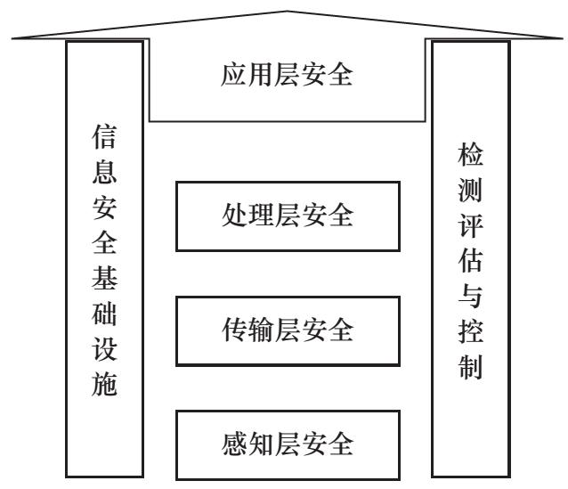

* 感知层安全机制
    * 轻量级密码算法  
        那些在2000门电路硬件资源之内可以实现的密码算法。
    * 轻量级认证技术  
        提供用户身份管理与设备身份管理等功能,实现物联网中所有接入设备和人员的数字身份管理、授权、责任追踪,以及传输消息的完整性保护。
* 传输层安全机制  
    * 节点认证、数据机密性、完整性、数据流机密性、 DDoS攻击的检测与预防。  
    * 移动网中 AKA 机制的一致性或兼容性、跨域认证和跨网络认证(基于IMSI)。  
    * 相应密码技术,包括密钥管理(公钥基础设施(PKI)和密钥协商)、端对端加密和节点对节点加密、密码算法和协议等。  
    * 组播和广播通信的认证性、机密性和完整性安全机制。  
* 处理层安全    
    * 可靠的认证机制和密钥管理方案。  
    * 高强度数据机密性和完整性服务。  
    * 可靠的密钥管理机制,包括PKI和对称密钥的有机结合机制。  
    * 密文查询、秘密数据挖掘、安全多方计算、安全云计算技术等。  
    * 可靠和高智能的处理能力。  
    * 抗网络攻击(如DDoS) ,具有入侵检测和病毒检测能力。  
    * 恶意指令分析和预防,访问控制及灾难恢复机制。  
    * 保密日志跟踪和行为分析,恶意行为模型的建立。  
    * 具有数据安全备份、数据安全销毁、流程全方位审计能力。  
    * 移动设备识别、定位和追踪机制。  
* 应用层安全  
    * 有效的数据库访问控制和内容筛选机制。
    * 身份隐私保护和位置隐私保护技术。
    * 叛逆追踪和其他信息泄露追踪机制。
    * 安全的电子产品和软件的知识产权保护技术。

####  **网络安全的含义是什么？**

网络系统的硬件、软件及其中数据受到保护，不受偶然的或者恶意的破坏、更改、泄露，保证系统连续可靠地运行，网络服务不中断的措施。

#### **试比较对称密码体制和非对称密码体制的特点**

> 密钥密码体系的分类
    通常大量使用的两种密钥加密技术是：私用密钥（对称加密）和公共密钥（非对称加密）。　　
    * 对称密钥加密系统  
        对称密钥加密，又称私钥加密或会话密钥加密算法，即信息的发送方和接收方用同一个密钥去加密和解密数据。它的最大优势是加/解密速度快，适合于对大数据量进行加密，但密钥管理困难。   
    * 非对称密钥加密系统  
        非对称密钥加密系统，又称公钥密钥加密。它需要使用不同的密钥来分别完成加密和解密操作，一个公开发布，即公开密钥，另一个由用户自己秘密保存，即私用密钥。信息发送者用公开密钥去加密，而信息接收者则用私用密钥去解密。公钥机制灵活，但加密和解密速度却比对称密钥加密慢得多。 

- 区别  
    首先， 用于消息解密的密钥值与用于消息加密的密钥值不同;其次， 非对称加密算法比对称加密算法慢数千倍，但在保护通信安全方面，非对称加密算法却具有对称密码难以企及的优势。
- 非对称加密算法的主要优势    
    使用两个而不是一个密钥值:一个密钥值用来加密消息，另一个密钥值用来解密消息。这两个密钥值在同一个过程中生成，称为密钥对。用来加密消息的密钥称为公钥，用来解密消息的密钥称为私钥。用公钥加密的消息只能用与之对应的私钥来解密，私钥除了持有者外无人知道，而公钥却可通过非安全管道来发送或在目录中发布。
- 总结  
    1. 对称加密加密与解密使用的是同样的密钥，所以速度快，但由于需要将密钥在网络传输，所以安全性不高。
    2. 非对称加密使用了一对密钥，公钥与私钥，所以安全性高，但加密与解密速度慢。
    3. 解决的办法是将对称加密的密钥使用非对称加密的公钥进行加密，然后发送出去，接收方使用私钥进行解密得到对称加密的密钥，然后双方可以使用对称加密来进行沟通。

#### **说明密码攻击的主要类型及目标** 

1. 惟密文攻击  
    在惟密文攻击中，密码分析者知道密码算法，但仅能根据截获的密文进行分析，以得出明文或密钥。由于密码分析者所能利用的数据资源仅为密文，这是对密码分析者最不利的情况。

2. 已知明文攻击
    已知明文攻击是指密码分析者除了有截获的密文外，还有一些已知的“明文—密文对”来破译密码。密码分析者的任务目标是推出用来加密的密钥或某种 算法，这种算法可以对用该密钥加密的任何新的消息进行解密。

3. 选择明文攻击  
    选择明文攻击是指密码分析者不仅可得到一些“明文—密文对”，还可以选择被加密的明文，并获得相应的密文。这时密码分析者能够选择特定的明文数据块去加密，并比较明文和对应的密文，已分析和发现更多的与密钥相关的信息。密码分析者的任务目标也是推出用来加密的密钥或某种算法，该算法可以对用该密钥加密的任何新的消息进行解密。

4. 选择密文攻击  
    选择密文攻击是指密码分析者可以选择一些密文，并得到相应的明文。密码分析者的任务目标是推出密钥。这种 密码分析多用于攻击 公钥密码体制。

#### **用公钥密码算法如何实现数字签名？如果该签名过程有保密要求，如何设计？如果签名的对象很长，又如何处理？请分别作图说明。**

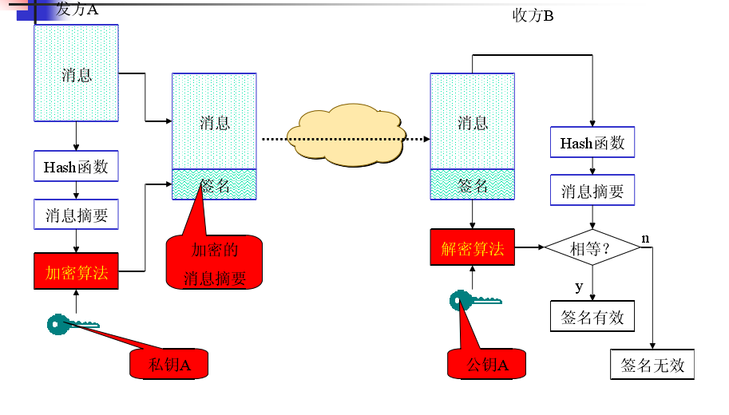

#### **物联网三层体系结构主要包括哪三层，简述每层内容**

1. 感知层  
    感知层有数据采集子层，短距离通信技术和协同信息处理子层组成。数据采集子层通过各种类型的传感器获取物理世界智能光发生的物理时间和数据信息。短距离通信技术和协同信息处理子层将采集到的数据在局部范围内进行协同处理，以提高信息的精度，降低信息冗余度，并通过自组织能力的短距离传感网介入广域承载网络。它旨在解决感知层数据与多种应用平台间的兼容性问题。

2. 网络层  
    网络层主要将来自感知层的各类信息通过基础承载网络传输到应用层。

3. 应用层   
    应用层主要将物联网技术与行业专业系统相结合，实现广泛的物物互联的应用解决方案，主要包括业务中间件和行业应用领域。用于支撑跨行业，跨医用，跨系统之间的信息协同，共享，互通。

#### **简述物联网的安全体系结构** 

物联网的安全体系结构主要包括3部分：感知层安全、传输层安全、处理层安全以及应用层安全。
1. **感知层**安全包括感知节点的安全和感知层内部的传输安全,其中感知节点的安全是指节点不被敌手控制,即敌手不能获取感知节点的密钥,而感知层内部的传输安全是指消息传输过程中不能被非法窃听和恶意修改、伪造等;

2. **传输层**安全主要是从感知层汇聚节点(如传感器网关)到数据处理中心传递过程的安全,其目标是防止非法用户的窃听、伪造和篡改;

3. **处理层**安全是指处理平台本身的系统安全和各用户数据和计算环境之间的边界控制(如使用虚拟计算);

4. **应用层**安全主要是针对不同行业特点提出的特殊安全需求,包括隐私保护、终端防护等。

#### **物联网目前存在哪些安全隐患** 

1. **物理安全**:主要是传感器的安全,包括对传感器的干扰、屏蔽、电磁泄露攻击、侧信道攻击等;

2. **运行安全**:主要存在于各个计算模块,包括嵌入式计算模块、服务器的计算中心等,包括密码算法的实现(如黑盒或白盒实现)、密钥管理(硬件或软件存储密钥)、数据接口和通信接口管理等,涉及传感器节点、数据汇聚节点和数据处理中心;

3. **通信安全**:是指数据在传输过程中的安全保护,确保数据在传输过程中不会被非法窃取、篡改、伪造等。

#### **物联网的安全技术有哪些**

* 可靠的认证机制和密钥管理方案  
* 高强度数据机密性和完整性服务  
* 隐私保护技术  
* 身份隐私保护和位置隐私保护技术  
* 叛逆追踪和其他信息泄露追踪机制

#### **物联网的感知层在安全技术上，包含哪些内容**

1. 轻量级密码算法  
    那些在2000门电路硬件资源之内可以实现的密码算法。
2. 轻量级认证技术  
    提供用户身份管理与设备身份管理等功能,实现物联网中所有接入设备和人员的数字身份管理、授权、责任追踪,以及传输消息的完整性保护。

#### **蓝牙有哪些安全机制**

1. 随机码生成  
    每个蓝牙设备都有一个伪随机码发生器，它产生的随机数可作为认证私钥和加密私钥。在蓝牙技术中，仅要求随机码是不重复的和随机产生的。  
2. 密钥管理  
    加密私钥的长度是由厂商预先设定的，用户不能更改。为防止用户使用不允许的密钥长度，蓝牙基带处理器不接受高层软件提供的加密私钥。  
3. 加密  
    采用加密方式可以保护用户信息，但接入码和报头不加密。在蓝牙技术中，用序列加密算法E0加密用户信息。  
4. 认证  
    在蓝牙技术中，认证采用口令－应答方式。验证方要求申请者鉴别随机数AU_RAND及认证码E1并返回计算结果SRES，若双方的计算结果相等则认证成功。

#### **防火墙的基本类型有哪些，其作用是什么**

* **静态包过滤防火墙**（Static packet-filtering firewall）。该防火墙被描述为第一代防火墙，其工作在OSI模型的layer3，过滤的参数是静态设定的。其主要根据网络层和传输层的数据包头部，以及数据流的传输方向进行过滤。根据该描述，静态包过滤防火墙和Stateless Packet Filtering防火墙是一致的。由于是静态包过滤，所以该防火墙的效率也是比较高的。该防火墙也被称为无状态分组过滤防火墙，路由器中所使用的扩展ACL即是这种防火墙的典型。

* **电路级防火墙**（Circuit-level firewall）。该防火墙被描述为第二代防火墙。其主要功能是作为TCP的中继，故因为工作机制类似中继，可能才被命名为Circuit-level。该防火墙主动截获TCP与被保护主机间的连接，并代表主机完成握手工作。当握手完成后，该防火墙负责检查只有属于该连接的数据分组才可以通过，而不属于该连接的则被拒绝。由于其只检查数据包是否属于该会话，而不验证数据包内容，所以其处理速率也是较快的。

* **应用级防火墙**（Application layer firewall）。该防火墙被描述为第三代防火墙。其主要功能是在建立连接之前，基于应用层对数据进行验证。所有数据包的数据都在应用层被检测，并且维护了完整的连接状态以及序列信息。应用层防火墙还能够验证其他的一些安全选项，而且这些选项只能够在应用层完成，比如具体的用户密码以及服务请求。代理服务器防火墙应该属于应用级防火墙的一种具体实现。

* **动态包过滤防火墙**（Dynamic packet-filtering firewall）。该防火墙被描述为第四代防火墙，其主要工作在OSI 3，4，5层上。这一代防火墙也被称为有状态（stateful）防火墙，其通过本地的状态监控表，用来追踪通过流量的各种信息。该信息可能包含：1.源/目的TCP和UDP端口号。2.TCP序列号。3.TCP标记。4.基于RFCedTCP状态机的TCP会话状态。5.基于计时器的UDP流量追踪。同时，有状态防火墙通常内置高级IP处理的特性，比如数据分片的重新组装以及IP选项的清楚或者拒绝。有状态防火墙甚至可以访问控制上层应用协议，比如FTP和HTTP协议，提供一种高层协议的过滤功能。

#### **与有线网络相比，无线局域网具有哪些优点？WLAN可分为哪两大类，请分别作图说明？**

WSN特点: 低成本、低能耗、可快速部署、实时性和灵活性等优势

#### **简述无线传感网的安全性目标**

|安全需求|描述|
|-----|-----|
|可用性| 确保系统完成基本任务,包括攻击状况,如DoS|
|完整性| 确保信息不受篡改或破坏,抵御假消息注入等攻击|
|机密性 |信息不暴露给未授权的实体,抵御窃听等攻击|
|认证性| 确保节点身份真实可信,防止冒名攻击如女巫攻击等|
|可控性 |保证系统的授权认证和监控管理|
|数据新鲜性|确保消息的新鲜性,防止重放攻击|
|高效性 |存储复杂度、计算复杂度、通信复杂度|
|攻击容忍性/抗毁性|当部分节点受损后,未受损节点被暴露的可能性|
|可扩展性|安全解决方案应当与网络规模无关,即能够适应不同规模|
|灵活性|支持节点动态加入和退出,随时排除受损节点|

#### **应用层面临的安全问题有哪些方面？**

1. 来不及识别和处理海量数据  
2. 智能设备的智能失效， 导致效率严重下降  
3. 自动处理失控  
4. 无法实现灾难控制并从灾难中恢复  
5. 非法认为干预造成故障  
6. 设备从网络中逻辑丢失

#### **数据库常用安全有哪些？简要说明**

1. 用户认证技术  
2. 安全管理技术
3. 数据库加密技术

## 2、数据加密技术

### 2.1、古典密码

**栅格加密法**  
把要被加密的文件按照一上一下的写法写出来,再把第二行的文字排列到第一行的后面。相应的,破译方法就是把文字从中间分开,分成2行,然后插入  

* 加密
    information
* 分行
    i f r a i n
    n o m t o
* 合并
    ifrainnomto

**替换密码——恺撒(Caesar)密码**   
明文中的所有字母都在字母表上向后(或向前)按照一个固定数目进行偏移后被替换成密文。   
例如,当偏移量是3的时候,所有的字母A将被替换成D,B变成E,以此类推X将变成A,Y变成B,Z变成C。  
由此可见,位数就是凯撒密码加密和解密的密钥。  

**维热纳尔(Vigenere)密码**  
它实际上是自动密钥(autokey)加密法的一个简化形式,是基于关键词的加密系统。关键词写在明文的上面,并不断重复书写,这样每个明文字母都与一个关键词的字母关联。

**普莱费尔(Playfair)密码**  
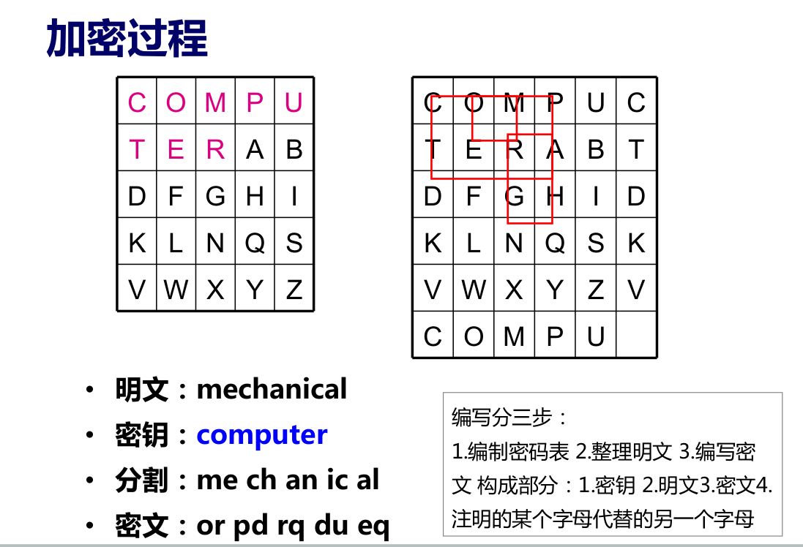

**希尔密码**  
希尔密码(Hill Password)是运用基本矩阵论原理的替换密码,由Lester S. Hill在1929年发明。每个字母当作26进制数字:A=0, B=1,C=2... 一串字母当成n维向量,跟一个n×n的矩阵相乘,再将得出的结果模26。

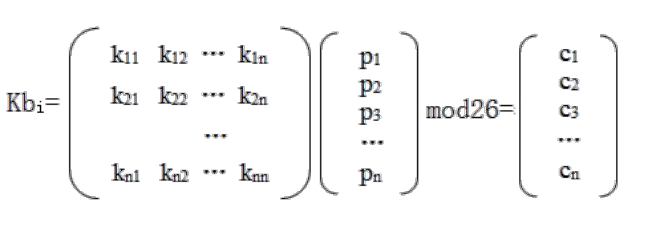

**小结**  
- 基于替换的思想
- 安全性依赖密钥的保密
- 能有针对性地设计算法

## 3、近代密码学

**编码的原则**  
加密算法应建立在算法的公开不影响明文和密钥的安全 。

**理论安全**  （香农）  
要达到“理论安全”,密钥的长度必须长于或等于明文的长度。

**发展趋势**  
* 古典密码  
    源于对自然的感性认识， 依赖技巧与算法本身的保密
* 近代密码  
    数学理论的发展， 开始运用理性思维设计算法  
* 现代密码  
    计算机科学的发展和数学的进一步发展， 以严密的科学理论作为支持

## 4. 现代密码学

**现代密码学**  
* 基于计算机科学的发展
    - 不再依赖技巧,而以数学理论为基础
    - 安全性完全依赖于严密的数学证明
    - 允许引入大量复杂运算
    - 高效准确
    - 破解代价极高,且极度依赖数学的发展

**加密与解密**  
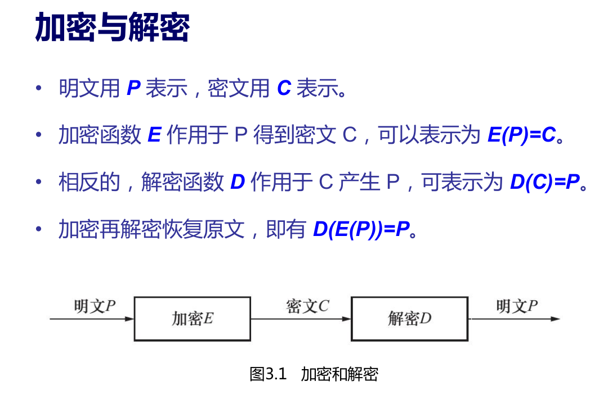

**对称加密**  
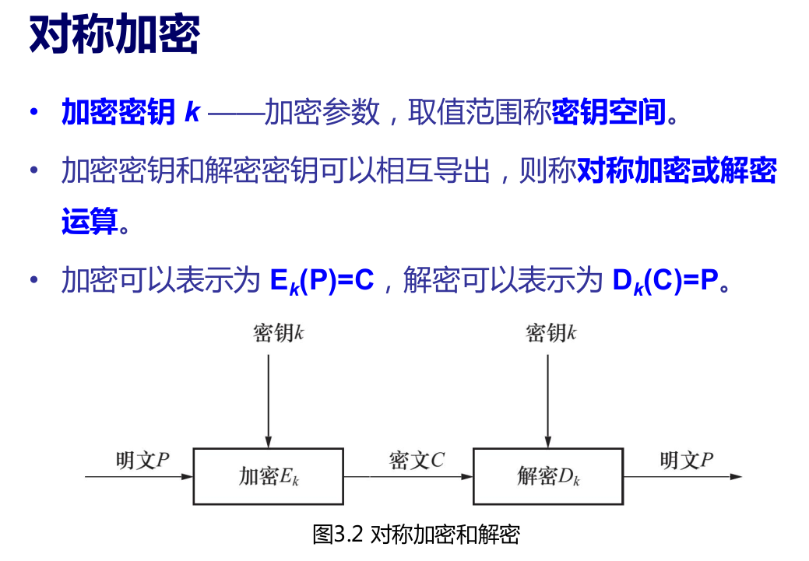

**非对称加密**  
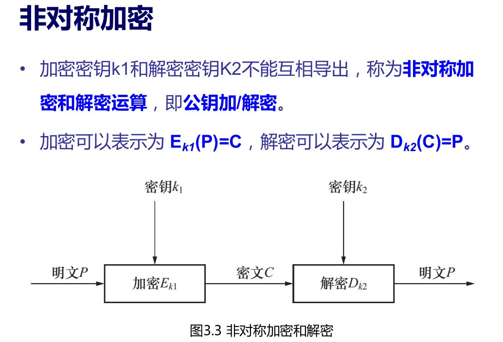

**密码体制**  
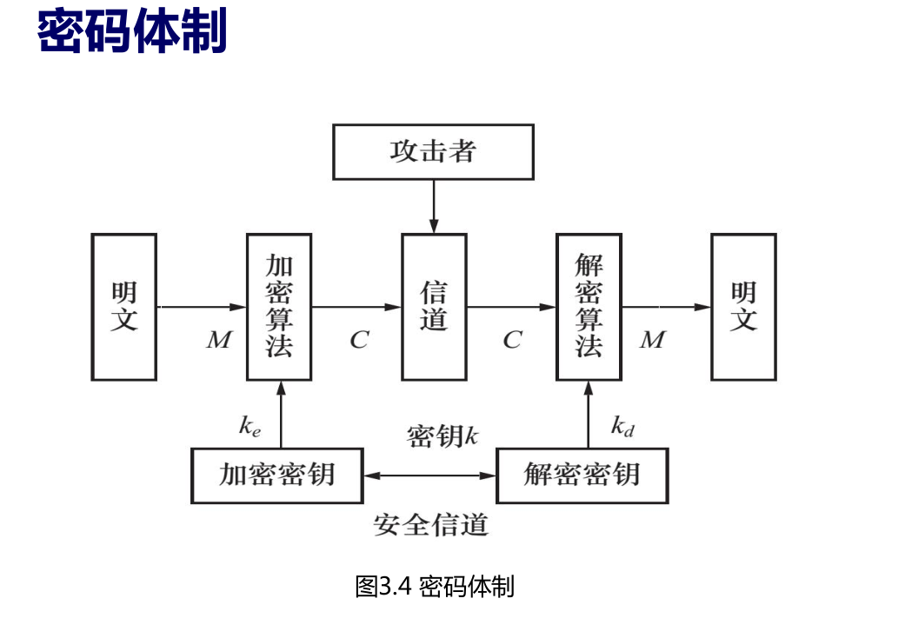

**密码体制的分类**  
* 对称密码体制  
    - 如果一个密码体制的 k d =k e ,或由其中一个很容易推导出另一个。
* 非对称密码体制

* 公开密码体制
    - 如果在计算上kd 不能由 ke 推导出来,这样 ke 公开也不会损害kd
的安全,于是便可以将ke 公开。

**攻击密码系统的方法**  
* 穷举攻击
    - 遍历所有可能的密钥
    - 时间=尝试次数*一次加解密需要的时间
    - 方法:通过增大密钥的长度,从而增加破解时间
* 统计分析攻击
    - 分析密文和明文的统计规律,如古典密码
    - 方法:统计特性在密文和明文中不体现
* 数学分析攻击
    - 针对加解密算法的数学基础和某些密码学特性
    - 方法:选用具有坚实数学基础和足够复杂的加解密算法

**破译密码的类型**  

* 唯密文攻击
    - 部分密文->明文->密钥
* 已知明文攻击
    - 部分密文+明文->密钥、算法
* 选择明文攻击
    - 部分密文+明文+可选择明文块->密钥、算法
* 自适应选择明文攻击
    - 部分密文+明文+可选择明文块+修正->密钥、算法
* 选择密文攻击
    - 选择密文+明文->密钥
* 选择密钥攻击
    - 不同密钥间的关系
* 非技术攻击
    - 威胁、勒索、逼迫、行贿、购买

**评价密码体制的安全性**  
* 无条件安全性
    - 破解者即使具有无限的计算能力,也不能攻破密码
* 计算安全性
    - 最好的破解算法在有限的时间内不能破译密码
* 可证明安全性
    - 归结为某个数学难题

**安全性的原则**  
* Shannon 提出的设计密码系统的两种基本方法。
* 对于分组密码,安全性的两个设计原则是扩散和混淆。
* 扩散原则
    - 设计的密码算法应使明文中的每一位影响密文中的许多位,或者说让密文中的每一位受明文中的许多位的影响。
* 混淆原则
    - 设计的密码算法应使得密钥和明文以及密文之间的依赖关系变得尽可能复杂。

**公钥密码算法**  
* 基本思想:将密钥分为加密密钥 $K_e$ 和解密密钥 $K_d$ ,用加密密钥 $K_e$ 控制加密,用解密密钥 $K_d$ 控制解密。而且由计算复杂性确保加密密钥 $K_e$ 在计算上不能推导出解密密钥$K_d$ 。

* 优点:即使将 $K_e$ 公开也不会暴露 $K_d$ ,也不会损害密码的安全。从根本上克服了传统密码在密钥分配上的困难。

**安全性需求**  
* 不可伪造性
    - 在不知道签名者私钥的情况下,敌手很难有效地伪造一个合法的数字签名。
    
* 完整性
    - 任何对消息的修改都将会导致(消息,签名)对无法通过验证。
    
* 不可否认性
    - 签名后,签名者将无法否认自己对消息的签名。

**公钥密码加/解密流程**  
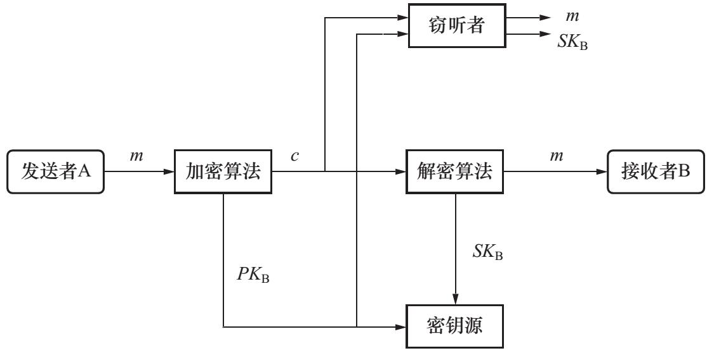

**对公钥密码的攻击** 
* 穷举攻击
    - 依赖于密钥的长度,但太长则降低加密效率。
    
* 推导秘密钥攻击
    - 寻找由公钥推导私钥的方法,无法证明不可行,即理论上可行。
    
* 可能字攻击
    - 用算法的公开钥对所有可能的密钥加密后与截获的密文相比较,可添加一些随机比特。

## 5、数字签名

* 数字签名又被称为数字签字、电子签名、电子签章等,主要用于在网络环境中模拟日常生活中的手工签字或印章。

* ISO定义:数字签名是指附加在数据单元上的一些数据,或是对数据单元所做的密码变换,这种数据或变换允许数据单元的接收者用以确认数据单元来源和数据单元的完整性,并保护数据,防止被人伪造。

* 简单地说,数字签名是指消息的发送者通过某种签名方法产生的别人无法伪造的一段“特殊报文”,该报文就是签名

## 6、信任 

**定义**  
实体 A 认定实体 B 将严格按 A 期望的方式行动,则实体 A信任实体 B,其中实体 A是信任者,B 是被信任者。

**信任的特点**  
* 主观性 
* 可度量性
* 不确定性 
* 动态性
* 风险性 
* 非对称性
* 条件相关性 
* 弱传递性
* 多面性 
* 社会网络相似性

**信任的建立**
* 信任 —— 特指网络环境下的信任。
* 建立途径:
    - 获得公开密钥信息
    - 共享密钥
    - 公钥证书(由可信第三方颁发)
* 信任的传递
    - A→B→C

## 7、公钥基础设施（PKI） 

* 公钥基础设施(PKI)是由一系列软件、硬件、人、策略及流程组成的,用于创建、管理、分发、使用、储存及无效化的数字证书管理平台,它能够为网络通信应用提供加密和数字签名等密码服务及所必需的密钥和证书管理体系。

* PKI 就是利用公钥理论和技术,为网络上的一系列安全服务,防止窃听、非法入侵、篡改、否认等威胁而建立的基础设施。

* PKI 技术是信息安全技术的核心,也是物联网、电子商务、电子政务等相关服务的关键和基础技术

### 7.1、公钥认证模型

**PGP(Pretty Good Privacy)模型**
> 由公钥的所有者相互之间保证的方式。

* PGP(Pretty Good Privacy),是一个基于RSA公钥加密体系的邮件加密软件。可以用它对邮件保密以防止非授权者阅读,它还能对邮件加上数字签名从而使收信人可以确认邮件的发送者,并能确信邮件没有被篡改。

*  它可以提供一种安全的通讯方式,而事先并不需要任何保密的渠道用来传递密匙。它采用了一种RSA和传统加密的杂合算法,用于数字签名的邮件文摘算法,加密前压缩等。

* 它的功能强大,速度很快,源代码免费。

**PGP 管理证书的信任网(Web Of Trust)**
* PGP采用信任网结构(Web Of Trust)的分布式密钥管理,这种密钥管理体制下没有密钥证书管理机关(CA),用户之间的身份认证问题是通过介绍人(introducer)来解决的。

* 所有的用户产生并分发他们自己的公开密钥,用户通过相互对公开密钥签名以创建一个包含所有PGP用户的信任网(Web Of Trust)。

* 在信任网中,没有大家都信任的中心权威机构,用户以各自为中心,相互认证公钥,相互签名公钥证书。

* 这些签名使得用户的公钥彼此相连,形成自然的网状结构,也就是所谓的信任网。

**CA认证模型**
> 由可依赖的第三方机构TTP保证公钥的所有者。

* TTP发行证书,颁发给用户。

* 收信方验证证书的有效性。

* 证书有效则公钥合法,否则非法。      

## 8、无线传感网

**WSN(Wireless Sensor Networks)**
- 通过部署在监测区域内的大量的具备有限数据处理、传输、存储和计算能力的传感器节点对物质性质、环境状态、行为模式等信息进行大规模、长期、实时的获取。
- WSN构成:传感器节点、汇聚节点、管理节点。
- WSN特点:低成本、低能耗、可快速部署、实时性和灵
活性等优势
- WSN面临着比传统网络更大的安全威胁。

**WSN面临的安全挑战**  
* 对传感网节点(普通节点或网关节点)的拒绝服务(DoS)攻击。

* 传感网的普通节点被敌手捕获(但没有控制,因为没有得到节点密钥)。

* 传感网的普通节点被敌手控制(敌手掌握节点密钥)。

* 传感网的网关节点被敌手控制——安全性全部丢失。

### 8.1、安全威胁 

1. 被动攻击
> 只对信息监听,而不对其修改。  

    * 窃听
        * 监听通信
        * 获取数据包中的关键数据
        * 直接占用网络资源
    * 流量分析
        * 通过流量分析可以发现信息源
        * 暴露关键节点、簇头、基站等重要位置
2. 主动攻击  
> 对信息进行修改和伪造 

    * 节点俘获攻击 
    * 选择转发攻击
    * 节点复制攻击 
    * 呼叫洪泛攻击
    * 女巫攻击 
    * 重放攻击
    * 虫洞攻击 
    * 消息篡改攻击
    * 黑洞攻击 
    * 合谋攻击
    * 拒绝服务攻击

### 8.2、安全机制

1. 密钥管理机制
2. 数据加密机制
3. 认证及完整性保护机制
4. 路由安全机制
5. 安全数据融合机制

### 8.3、WSN秘钥管理

**密钥管理**

* (一)基于对称密码体制的密钥管理
    * [随机密钥预分配](#随机密钥预分配)
    * [确定性密钥预分配](#确定性密钥预分配方案)
    * [基于位置信息的密钥预分配](#基于位置信息的密钥预分配方案)
* (二)基于非对称密码体制的密钥管理
    * 基于Merkle树的密钥管理方案
    * 基于IBC的密钥管理方案
    * 基于群组的传感器网络密钥管理

#### 随机密钥预分配

* E-G方案(2002,Eschenauer,随机图论)
* 工作原理
    - 密钥预分配阶段:部署前,每个节点从密钥池S中选择k个密钥组成密钥环,保证一定概率的共享密钥
    - 共享密钥发现阶段:部署后,通过广播密钥环,两个相邻随机选择一个共享密钥作为配对密钥
    - 密钥路径建立阶段:通过存在共享密钥的相邻节点建立一条密钥路径
    
* 优点
    - 节点存储少量密钥就能够以一定概率建立安全路径
    - 密钥预分配时不需要预先知道节点先验信息如位置和邻接关系
    - 部署后节点间进行高效的自组织密钥协商而不需要基站参与
    - 建立共享密钥的通信开销小,具有良好的分布特性
* 缺点
    - 建立密钥路径的通信代价大
    - 攻击容忍性较差,被俘节点影响其他节点安全性
    - 不具有节点认证性(可能有多个节点拥有相同密钥)
    - 只能保证一定概率的网络连通度和直接密钥
    - 无法抵御节点复制攻击、女巫攻击等

#### 确定性密钥预分配方案

* 基于网格(Grid)的密钥预分配方案
* GBKP(Grid Based Key Predistribution)
    - 网格的每行、每列各共享一个多项式
    - 同行或同列节点可以基于共享多项式直接建立配对密钥
    - 通过汇合点与其它行或列的节点建立密钥路径
* PIKE(Peer Intermediaries for Key Establishment)
    - 节点按网格行列进行编号
    - 部署前,同行或同列节点先建立配对密钥
    - 节点按行列进行部署
    - 部署后,不同行列的节点通过行列交叉节点建立密钥路径
* 特点:
    - 优点:连通度高,通信和存储开销较小
    - 缺点:部署方式固定,不够灵活,中间节点存在单点失效

#### 基于位置信息的密钥预分配方案

* CPKS思路:
    - 部署前,每个节点与预期位置相邻的c个节点建立配对密钥
    - 部署后,相邻节点通过交换节点标识符确定双方是否存在共享密钥
    * 优点:
        - 相邻节点都具有配对密钥,网络规模不受限制
        - 配对密钥依赖位置信息,节点受损不影响其它节点
    * 缺点:
        - 密钥连通概率依赖预配对的密钥数量
* LBKP思路:
    - 部署区域划分为n个大小相等且相互邻接的正方形区域
    - 部署前,服务器生成n个t阶二元多项式,指派到每个区域,并把相邻区域的多项式分配给每一个节点(4+1)
    - 部署后,相邻区域的节点通过共享多项式即可建立配对密钥,不相邻的节点则可以通过多跳建立密钥路径
    * 优点:
        - 解决了CPKS密钥连通受限的问题
        - 抗毁性明显提高
    * 缺点:
        - 计算和通信量开销较大

#### 对称方案存在的问题
1. 无法提供完全的点到点的安全链接,只能提供一定的直接
密钥概率,路径密钥的建立有很大的通信负担
2. 攻击容忍性差,节点一旦被俘,影响其它节点甚至整个网
络的安全性
3. 不能提供实体认证
4. 只能支持点对点通信,不支持组播或广播通信

综合分析
* 随机密钥分配方案
    - 主流方向
    - 计算、存储、通信开销较小、良好的分布特性
    - 不能提供最佳的密钥连通概率
* 确定性密钥分配或基于对称密码体制的方案
    - 保证任意节点间都能建立密钥连接
    - 计算、存储、通信开销较大
* 需要高效、轻量级的密钥管理方案

## 9、TCP/IP安全体系

### 9.1、SSL

> 是一个传输层安全协议

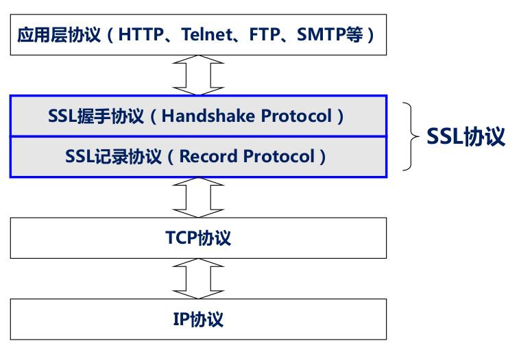

* SSL主要提供三类服务:
    - 认证用户和服务器,确保数据发送到正确的客户机和服务器
    - 加密数据以防止数据中途被窃取
    - 维护数据的完整性,确保数据在传输过程中不被改变
    

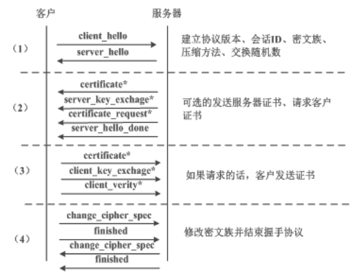

### 9.2、TLS

> 在C/S模式下提供安全通信环境, 常用于HTTP/LDAP/FTP/TELNET等协议

### 9.3、SSH

* SSH传输层协议主要在不安全的网络中为上层应用提供一个加密的通信信道
* SSH传输层协议提供服务器身份认证、通信加密、数据完整性效验以及数据压缩等多项安全服务  

### 9.4、S/MIME

* MIME(Multipurpose Internet Mail Extensions),即多用途互联网邮件扩展,是目前互联网电子邮件普遍遵循的邮件技术规范。
* S/MIME (Secure MIME)
* 一种利用PKI证书对电子邮件进行加密签名的技术。
* 不仅可以用于邮件服务器,也可用于支持MIME的HTTP协议。
* 主要技术: X.509加密、签名算法
* 主要提供:电子邮件的认证性、机密性、不可否认性及完整性

### 9.5、VPN

* 基本功能
    - 不透明包传输
    - 数据安全性
    - 服务质量(QoS)保证
    - 隧道机制
* VPN(Virtual Private Network)虚拟私有网络
    * 利用加密通道连接远程人员与公司内部业务网络。
    * 优点:构建低成本的企业专用网络,保证通信安全。
    * 缺点:安全性由服务提供商保证,企业不能控制。
* IPSec(Internet Protocol Security)
    * 借助PKI技术在VPN设备之间做双向认证加密
    * 涉及技术:IKE、SA、ESP、AH
    * 工作方式:透明模式(数据加密)、隧道模式(首部加密)
* VPN类型
    - Access VPN(远程访问VPN)←→传统的远程访问网络
    - Intranet VPN(企业内部VPN)←→企业内部的Intranet
    - Extranet VPN(企业扩展VPN)←→企业和合作伙伴的网络所构成

### 9.6、隧道技术

* 隧道技术通过对数据进行封装,在公共网络上建立一条数据通道(隧道),让数据包通过这条隧道传输。
* 隧道协议有两种:
    * 第二层隧道协议(数据链路层协议PPP封装)
        - L2F(RFC 2341,Layer 2 Forwarding)
        - PPTP(RFC 2637,Point to Point Tunneling Protocol)
        - L2TP(RFC 2661,Layer Two Tunneling Protocol)
    * 第三层隧道协议(网络层直接封装)
        * IP Sec (IP Security),最常用
        * GRE(RFC 2784,General Routing Encapsulation)

### 9.7、因特网面临的安全威胁

* 开放性:
    - 规范公开,按照规范就能实现互联互通
* 脆弱性:
    - 无中心、缺乏整体规划和设计、拓扑结构不清晰
    - 缺乏容错和可靠性
* 攻击:
    - 线路窃听、身份欺骗(IP地址欺骗)
    - 数据篡改、口令盗用、中间人攻击
    - 拒绝服务攻击等

##  10、WSN其他安全技术

#### 10.1、安全路由

* 路由协议的主要任务:
    * 寻找源节点与目的节点间的优化路径
    * 将数据沿优化路径正确转发
* 无线传感器网络脆弱原因:
    * 感知、数据融合、路由、资源限制、易受攻击

#### 10.2、安全定位

* 作用
    * 传感器网络主要依赖位置信息建立网络的空间关系
    * 是网络拓扑自配置、实时统计网络覆盖质量、协助路由等功能的基础
* 攻击
    * 对距离/角度估计方法的攻击
        - 干扰距离判断:改变信号发射强度、延迟发送时间或传播错误的跳数、改变物理介质、设置磁场
    * 对位置计算的攻击
        - 位置欺骗、无线信号干扰
    * 对定位算法的攻击
        - 分布式特性:女巫攻击、重放攻击、虫洞攻击

#### 10.3、数据融合

* 功能:
    * 在融合节点对冗余数据进行过滤、筛选,去除冗余,并对原始数据进行简单计算和处理,将处理后的数据向上层节点传输。
* 安全目标:
    * 保证基站最终得到正确的融合数据结果
    * 要求融合过程能够抵御各种攻击,保证数据的完整性、机密性、新鲜性和认证性。

## 11、物联网处理层安全

> 处理层:更有效地管理和分析数据  

核心问题:
* 如何利用有效的计算能力,高效地组织、存储和管理数据,对数据进行智能分析,将其转化为有价值的信息和知识,成为进一步决策的依据。

### 11.1、安全威胁

* 病毒:具有自我复制能力的计算机代码。能够损坏硬件、软件、数据等,具有很好的传播能力。

* 木马:表面上是有用的正常程序,实际却起着破坏作用,为攻击者打开攻击系统的大门。

* 恶意攻击:如拒绝服务攻击、分布式拒绝服务攻击等,造成网络、系统的资源耗尽,平台无法正常提供服务。

* 非授权访问:物联网用户往往将很多敏感数据上传到处理层,如果恶意用户能够访问到超出他们访问权限的敏感数据,则对用户的数据安全造成极大威胁

* 数据窃取与篡改:窃取用户的数据,会使用户的隐私暴露出来。如果攻击者对数据进行篡改,更会造成不可想象的损失

* 灾难:包括自然灾难和人为灾难。比如,台风、地震、火灾、水灾,或突然停电、服务器死机、人员误操作、蓄意破坏等

### 11.2、安全对策

* 针对病毒、木马、拒绝服务攻击等恶意攻击,建立物联网处理层网络安全的防御、检测、审计体系。
    - 防御是物联网处理层安全的第一道防线,以防火墙技术为基石,保护处理层所处的内部网络免受来自外部网络的恶意攻击
    - 作为对防火墙技术的补充,入侵检测技术用于对入侵行为的及时检测,并做出相应的响应。
    - 最后,对于已经发生的攻击行为,系统要能够找到攻击者并提出证据,且能记录系统中发生的各种事件(包括攻击事件和非攻击事件),这是由安全审计技术实现的

* 针对恶意攻击者的非授权访问,物联网处理层需要建立访问控制机制,杜绝非授权访问行为,也可以达到保护数据机密性和完整性的目的

* 针对数据窃取行为,引入密文存储技术,以合适的加密存储层次、加密粒度和加密算法实现数据在服务器的密文存储,并通过密文检索技术实现对存储的密文的高效检索

* 针对数据篡改行为,引入完整性验证技术,及时发现被篡改的数据,达到数据完整性保护的目的

* 提出数据容灾方案
    - 包括数据备份方案和数据恢复方案,免得因为各种自然灾难、人为灾难而丢失大量数据

* 使用基于虚拟化技术的安全监控。
    - 物联网处理层与云计算平台有着紧密的关系,虚拟化技术是云计算的重要技术,既可以提供更好的存储管理能力,又可以为应用程序和系统提供更好的隔离性

## 12、访问控制

> 访问控制技术是为了防止低权限用户越权访问系统资源的关键技术

### 12.1、自主访问控制

**自主访问控制(Discretionary Access Control, DAC)**   
根据主体或主体所属的组来限制主体对客体的访问权限,是一种最常用且最为普遍的访问控制手段
- 主要思想:客体的所有者负责管理该客体的访问授权,有权分配、更改该客体的属性信息。通过主体的属性信息和访问请求来决定是否授予主体对特定客体的访问权限
- 访问控制策略:可以看成一个访问控制矩阵,以访问矩阵为标准来实现对请求合法性的判决。

### 12.2、强制访问控制

**强制访问控制(Mandatory Access Control,MAC)**
* 根据客体中信息的安全等级和访问客体的主体的安全等级来对主体进行访问控制。
* 特点:
    * 在系统初始化时,系统管理员分别为主体和客体设置相应的安全标签(也称为安全等级),如,公开、秘密、机密、绝密,这4个安全等级是由低到高的顺序
    * 在主体向客体发送访问请求时,访问控制比较主体和客体的安全等级,如果主体安全等级比客体高,则可以访问客体,否则不能访问客体

### 12.3、基于角色的访问控制

**基于角色的访问控制 (Role-based Access Control,RBAC)**
* 主要思想:
    * 首先为用户分配不同的角色,具有相同角色的一类用户拥有相同的访问权限
    * 然后再将系统的访问权限与角色建立对应关系,针对系统的安全需求为不同的角色授予相应的权限

**RBAC模式**  
一旦角色被分配到指定用户后,该用户就拥有此角色的所有权限,系统可以通过为用户动态分配角色来实现灵活的访问控制。
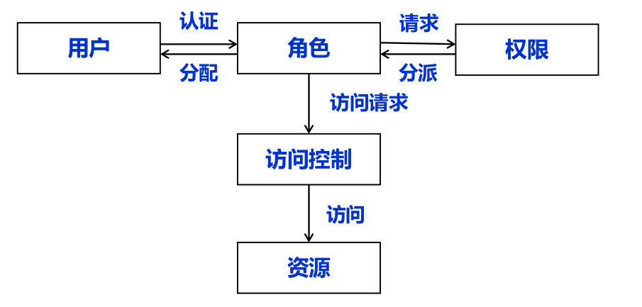

## 13、数据安全

### 13.1、机密性保护

> 由用户在客户端对数据进行加密,把加密后的密文信息存储在处理层的服务器,从而实现敏感数据在存储和传送过程中的机密性

* 处理层数据的机密性保护可以采用应用层加密方案。即由客户端应用程序实现加密/解密功能,服务器端只负责密文数据的存储。

* 加密粒度
    - 数据库级
        - 优点： 容易实现
        - 缺点： 即使对数据库进行很小数据量的查询或数据操纵(更新、删除等)操作,需要对整个数据库进行加密和解密在高共享的数据库系统中,由于在特定的时间段内需要接受大量的随机访问,采用数据库级别的加密粒度必然导致系统性能急剧下降。这种加密方式一般用来对脱机的备份数据库文件进行加密
    - 存储表级
        - 与数据库级别的加密粒度相比,这种加密粒度需求的操作开销大幅度减小,对数据库整体性能改善有较大提高对加密的表进行访问时,只需要检索特定的表,只对部分表进行解密,而不需要对整个存储空间进行解密操作,大大节省了对数据库的操作开销
    - 记录级
        - 缺点： 查询数据时,需要对加密和不加密的数据先进行分类处理
        - 优点： 与表级别的加密相比,这种加密粒度更细,处理起来也更加灵活，操作开销更小
    - 字段级
        - 字段级的加密是加密粒度最小的。这种加密方式需要精确的范围定义操作,一般在高保密性及高访问需求的系统中应用。

**密文检索**  
- 当用户想检索某个关键字时,
    - 首先在客户端对检索关键字进行加密
    - 然后向服务器发送加密的检索请求
    - 服务器收到用户的密文检索请求后对密文索引文件进行检索,生成密文检索结果,将排序后的检索结果返回给用户
    - 用户解密后获得明文文档的文档信息
    

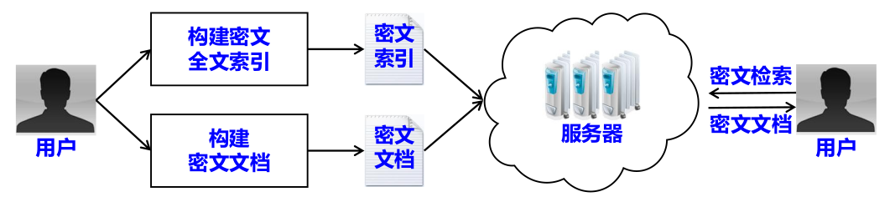

### 13.2、完整性保护

* 数据拆分技术  
     将数据以一定的冗余拆分成多个分片,分别存储到多个存储结点上,使得当部分结点发生错误时仍能恢复正确数据,保证数据的完整性和可用性
* WORM存储  
    只允许写入一次数据,且数据写入后不能被修改或删除,但是不限制读取数据的次数

**普通完整性检查**  

* 用户将文件从服务器上下载到本地后对文件完整性进行检查。

* 实现方式之一是,用户在上传文件前为文件计算一个哈希值并保存在本地;文件下载完成后计算哈希值,并与本地的哈希值进行比较,从而验证文件的完整性。

* 但在物联网处理层,由于通信开销过大,用户将全部数据下载到本地来检查其完整性的做法是不现实的。

**远程完整性检查**  
* 使用户在不需要取回全部数据的情况下,通过类似挑战-应答的协议,判断存储在远端服务器上的数据是否完好。典型的方法是:
    - 从文件中随机抽取若干数据块,分别计算每块的哈希值。将数据块与哈希值的对应表发送给可信第三方。并将完整的数据文件传给服务提供商。
    - 在验证阶段,验证工作交给可信第三方来完成,可信第三方定期向服务提供商发起挑战(要求返回指定的数据块),服务提供商则做出相应的应答。
    - 可信第三方计算数据块的哈希值,与表里的哈希值进行比较,从而验证数据的完整性,并将验证结果发送给用户。

### 13.3、数据容灾

> 一般应用高性能、大容量的存储系统和远程数据备份软件,通过高带宽网络将数据业务客户端和数据连接起来。

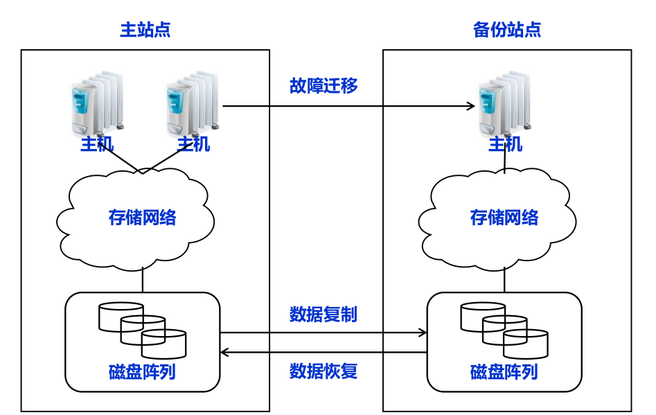  
数据容灾系统一般包括：
1. 数据备份子系统
2. 数据恢复子系统

**工作流程**
* 创建一张动态更新的数据备份记录表和一份备份日志,备份记录表中包括备份文件的各种属性信息(文件名、路径、修改日期等)

* 当备份记录表中的文件或数据发生变化时,在该表中记录并在备份日志中记录

* 对于记录表显示发生变化的文件,计算源服务器与目的服务器之间的差异数据

* 对差异数据进行数据加密,然后对加密后的数据进行网络传输

* 在差异文件传输完成后对数据的一致性和完整性进行验证

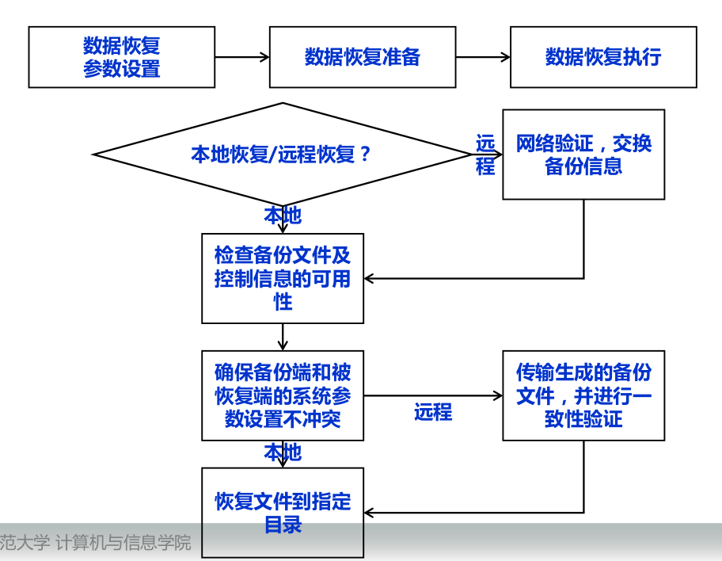

**容灾策略**  
* 完全备份:把分配给客户端的所有的数据进行备份。执行完全备份时,无需检查文件状态(标识文件是否修改),直接对数据进行完全的复制。

* 增量备份:仅备份最近一次备份后发生变化的文件。备份软件将检查备份记录和备份日志,查找文件状态。如果发现文件为新增加或被修改,则该文件将被传输到备份设备并进行备份,文件的状态信息将清除。

* 差量备份:仅对发生变化的文件进行拷贝,但数据复制完成后不清除文件状态。差量备份是以完全备份为基础的数据备份,以最近一次完全备份为起点,备份所有的变化的文件,即差量备份将备份最近一次完全备份之后的所有发生变化的数据。

## 14、虚拟化技术与云计算安全

### 14.1、虚拟化技术

> 将物理资源(如服务器、计算机等)抽象、转换为多台逻辑计算机的技术
- 在一个物理节点(服务器、计算机、网络等)上可以运行多台逻辑计算机,这些逻辑计算机不受现有资源的架设方式、地域或物理组态所限制。
- 每台逻辑计算机可运行不同的操作系统。
- 应用程序可以在相互独立的空间内运行而互不影响。

**传统架构的问题**
1. 服务器性能没有得到充分的利用
2. 更换硬件或迁移应用，都要先停机
3. 物理硬件故障、应用随之崩溃
4. 操作系统崩溃，应用随之停止

**虚拟架构**
1. 单一物理硬件可以对应多个操作系统
2. 一个操作系统崩溃不会影响到另一个
3. 应用和物理硬件都能够方便的添加和移除

**系统虚拟技术的应用**  
1. 动态快速部署
2. 虚拟机在线迁移
3. 服务器融合
4. 虚拟机容错

### 14.2、安全监控

> 基于虚拟化的安全监控一般借助虚拟机管理器实现安全隔离和安全防护的目的,可以有效提高虚拟化系统的安全性

* 虚拟安全监控技术分为:
    - 内部监控:在虚拟机中加载内核模块来拦截目标虚拟机的内部事件,而内核模块的安全通过虚拟机管理器来进行保护
    - 外部监控:通过在虚拟机管理器中对虚拟机中事件进行拦截,从而在虚拟机外部进行检测
    

**内部监控**  
* 被监控的系统运行在目标虚拟机中,安全工具部署在一个隔离的虚拟域(安全域)中。
* 这种架构支持在虚拟机的客户操作系统的任何位置部署钩子函数,这些钩子函数可以拦截某些事件,例如进程创建、文件读写等 。
* 在探测到虚拟机中发生某些事件时,钩子函数通过虚拟机管理器中的跳转模块,将虚拟机中发生的事件传递到管理域的安全驱动。安全工具执行某种安全策略,然后将响应发送到安全驱动,从而对虚拟机中的事件采取响应措施。

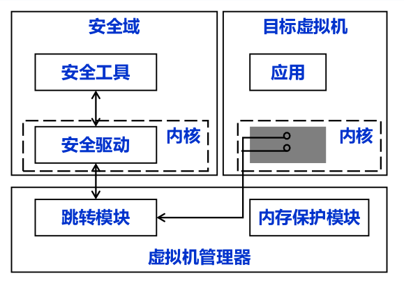

**外部监控**  
* 监控点部署在虚拟机管理器中,是安全域中的安全工具和目标虚拟机之间通信的桥梁。监控点拦截目标虚拟机中发生的事件,并将相应信息传递给安全工具。
* 安全工具根据安全策略产生的响应,通过监控点来控制目标虚拟机。
* 虚拟机管理器将安全工具与目标虚拟机隔离开来,增强了安全工具的安全性。
* 由于虚拟机管理器位于目标虚拟机的底层,因此监控点可以观测到目标虚拟机的状态(例如,CPU信息、内存页面等)。在虚拟机管理器的辅助下,安全工具能够对目标虚拟机进行检测。  

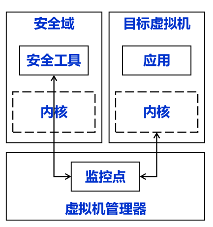

### 14.3、虚拟化安全措施

**防火墙云**
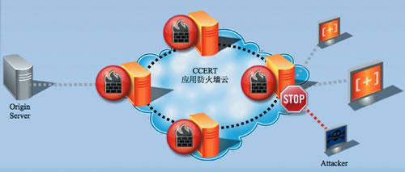

**入侵检测系统**
* 传统的入侵检测面临很多困难。比如,入侵检测系统无法同时实现与被检测系统有效的安全隔离和高效的检测能力,如果无法实现入侵检测系统与被检测系统的隔离,一旦被检测系统受到攻击,入侵检测系统也容易遭到恶意攻击或者被屏蔽。
* 利用虚拟化技术可以将入侵检测系统从被监控系统中转移出来

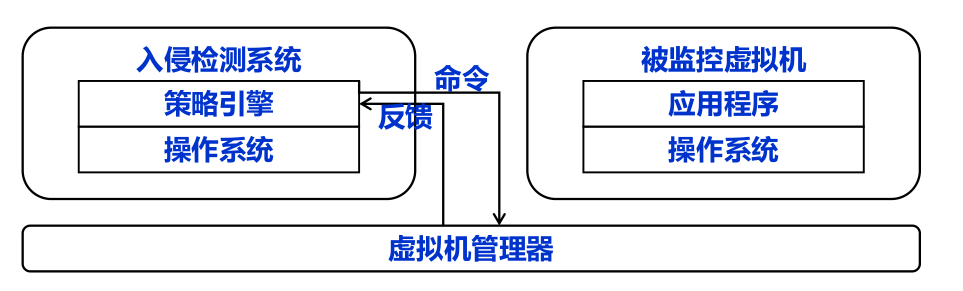

**安全审计**
* 安全审计:安全审计一般通过分析日志(如系统日志)信息来达到审计的目的。系统日志记录系统中硬件、软件和系统的问题信息,同时还可以监视系统中发生的事件。
* 系统管理员可以通过它来检查错误发生的原因,或者寻找攻击者留下的痕迹。
* 传统架构下的系统日志存在一个问题:依赖于记录日志的操作系统的完整性,如果入侵已经发生了,那么攻击者很有可能通过删除日志记录来隐藏其踪迹,这样,系统日志也就不再值得信赖了。
* 虚拟化技术显然可以克服这一缺点。

**蜜罐**
* 蜜罐通过构造类似于真实的系统环境,从而引诱恶意攻击,并分析攻击者的行为特征。
- 目前,蜜罐是研究最新恶意代码的有效手段,从中可以提取恶意代码的行为特征。
- 根据蜜罐部署的位置,蜜罐可以分为内部蜜罐和外部蜜罐。
    - 内部蜜罐部署在被监控系统内部,它能够提供丰富的信息,但可能会被恶意攻击者所破坏。
    - 外部蜜罐部署在被监控系统外部,它对恶意攻击者透明,但是不能获取系统内部事件。
- 由于在物理机器上部署蜜罐通常耗时而且代价大,因此,将蜜罐部署于虚拟计算环境是理想的方案。

### 14.4、云计算安全

|云计算的特点|安全威胁|
|--|--|
|数据和服务外包|(1)隐私泄露
(2)代码被盗|
|多租户和跨域共享|(1)信任关系的建立、管理和维护更加困难;
(2)服务授权和访问控制变得更加复杂;
(3)反动、黄色、钓鱼欺诈等不良信息的云缓冲
(4)恶意SaaS应用|
|虚拟化|(1)用户通过租用大量的虚拟服务使得协同攻击变得更加容易,隐蔽性更强;
(2)资源虚拟化支持不同租户的虚拟资源部署在相同的物理资源上,方便了恶意用户借助共享资源实施侧通道攻击。|

**云计算面临的安全挑战++**
* 云计算的安全保护涉及多个层面,需要从法律、技术、监管三个层面进行。
* 传统安全技术,如加密机制、安全认证机制、访问控制策略通过集成创新,可以为隐私安全提供一定支撑,但不能完全解决云计算的隐私安全问题。
* 需要进一步研究多层次的隐私安全体系(模型)、全同态加密算法、动态服务授权协议、虚拟机隔离与病毒防护策略等,为云计算隐私保护提供全方位的技术支持。

**云计算安全技术-数据隐私保护**
1. 加密字符串的精确检索
    - 基于离散对数的密文检索技术
    - 基于Bilinear Map的密文检索技术
2. 加密字符串的模糊检索
    - 基于BloomFilter的密文检索技术
    - 基于矩阵和向量变换的密文检索技术
3. 加密数值数据的算术运算
    - 基于矩阵和向量变换的密文计算技术
    - 含加/减/乘/除运算
4. 加密数值数据的排序运算
